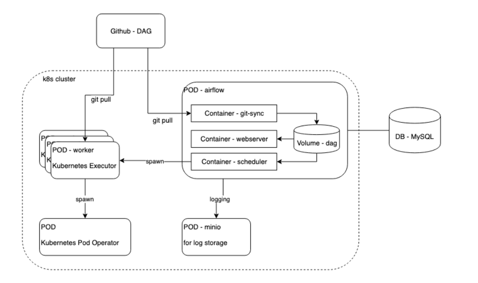
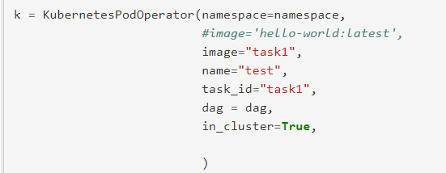
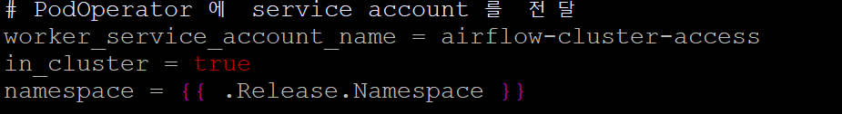

#### airflow on kubernetes
---

1.10 릴리즈 이후 KubernetesExecutor가 추가되었습니다.

    Celery is a distributed task queue that balances the workload across multiple nodes. Using Celery to schedule jobs on worker nodes is a popular approach to scale Airflow. Here you can find a Helm chart to automate the deployment with the CeleryExecutor. But if using Celery works so well, then why would we need another executor for Kubernetes? Because celery is quite complex. You need to deploy Celery as an extra component in your system. And Celery requires a broker such as RabbitMQ or Redis as back-end. Additionally, you probably want Flower, a web interface, to monitor Celery. Perhaps these many components add too much overhead for the task at hand? Can’t we have something more simple? Yes! Airflow 1.10 introduced a new executor to scale workers: the Kubernetes executor.

KubernetesExecutor를 사용한다면 job이 있을 때마다 pod을 생성하고 끝나면 지워지는 형태로 구성하여 리소스 관리를 적절하게 할 수 있다.

아래 이미지는 한 airflow pod 안에 구성을 했지만 현재 만든 구성은 
postgre, scheduler, web 세개의 pod으로 구성되어 있다. 

만약 KubernetesExecutor가 KubernetesPodOperator를 사용하지 않는다면 worker pod 내에서 작업이 수행되게 된다. 

KubernetesPodOperator를 사용한다면 새로운 Pod을 생성하여 image를 사용하는 동작으로 이뤄지며 pod내의 Executor는 기본적으로 localExecutor로 수행된다. 

**기본 구성**

namespace 같은 옵션은 airflow.cfg 파일에서 명시해줄 수 있고 그럴 경우 service account를 전달해 권한을 부여해줘야 한다. 

아래 airflow-cluster-access 는 현재 yaml로 구성된 service account 이고 rbac 작업을 통해 모든 클러스터에 접근할 수있는 권한을 부여해 준 상태이다.

이미지 경우 로컬에 저장되어 있거나 docker hub에 저장되어 있다면 사용 가능하다.

---
