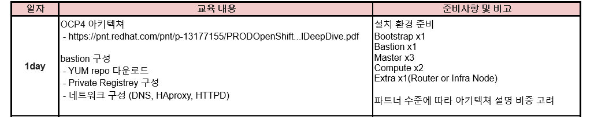

### OpenShift 파트너 교육 day1

----
#### 교육 일정

----

#### 1. 아키텍처

<!-- 컨네이너 : 가장 작은 컴퓨트 노드 binary 형태의 이미지를 빌드해서 생성

imageregistry : 이미지 저장
 -->

     DeploymentConfiguration - replica controller 랑 매치

     Demonset : Deployment 와 비슷하지만 특정 노드에 배치하고 싶을때 사용, (Deployment 는 loadBalancing을 기반하기 때문에 pod가 다 분산에서 배치)
     Demonset은 key-value 형태

     Service : 쉽게 말하면 Pod 간의 호출, label 을 바탕(key - value)

     Selector : 내부적으로 Selector 를 판별해서 동작하는 것임으로 (key-value) 와는 동작하는 방법이 다를 뿐이지 같은 동작을 구현 

    route : 내부적으로 service 가 pod의 ip를 식별해서 해주는 것 

    etcd : file storage 형태( key - value) 클러스터 상태 정보를 저장, etcd 백업을 통해 클러스트 백업을 진행 할 수 있음 
    
    
-----

#### 2. 설치

SELINUX (셀리눅스) : bastion - Disable 나머지 enable

install yaml 에서 base domain에 domain 정보 넘

metadata.name 에 cluster domain name

-----

private registry <-> image registry 가 다름

private registry 는 도커 레지스트리 (베스천 서버에 podman container 형태)

image registry 는 ocp registry pod 형태로 worker node 위에 띄워져 있음

인증서를 만들때 hostname 중요 -> hostname 위주로 진행하게 된다. 

`openshift-install create ignition-config --dir=install_dir/`
이 명령후 24시간 내에 완료해야함. (인증서 만료)

재설치할땐 directory 채로 날려야함 (auth정보가 남아있기 때문에)

------------

굳이 프라이빗 네트워크에 올라온 베스천 서버와 통신을 하기 때문에 firewall이 있을 필요가 없음.

DNS 통신

- 정방향 영역 : Domain ->ip, 도메인을 물었을 때 ip로 연결해주는 영역

- 역방향 영역 : Ip -> Domain  ip를 물었을 때 Domain으로 연결해주는 영역
   
-----
