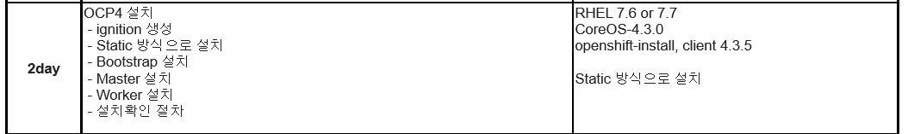

### Opneshift 파트너 교육 Day2 ~ 4
---
#### 교육일정 

----

ignition을 만드는 첫번째 install-config.yaml 을 만드는 것

install-config로 ignition file을 만듬

manifast 는 operator의 기본이 되는 정보

iginition 파일들은 다 base64로 암호화가 되어있어야함
우리는 hostname을 추가해야함 /etc/hostname -> coreos의 path

masker 와 worker의 ign 차이는 source 부분에 master 인지 worker 인지 한 문장 차이
그걸 보고 처음에 os 가 설치하면서 각 노드들에 부합한 pod가 생성되면서 클러스터링 됨
bootstrap 은 차이가 조금 있음 -> storage 부분 coreos가 설치에 사용하거나 openshift manifast 파일을 써서 어떻게 pod 를 띄울것인지 등이 들어가있음 즉 기본 정보들을 bootstrap을 설치하고 다른 노드에서 bootstrap에 정의된 정보들을 가져가는 형식
내부적으론 bootstrap에서 크라이오 엔진이 사용되서 podman이 실행되고 마스터 노드 쪽으로 컨테이너 단위의 복제가 이루어지는 형식

---

csr 은 인증되면 지워짐

---

bootstrap을 모니터링하는 방법

1. bootstrap에 접속하여 jounelctl -u bootkube.service

----

순서
bootstrap -> mater -> worker

이미지마다 다이제스트가 존재 완전하게 버전이 맞아야함
installer 가 중요 ~~ 
clent 는 그래도 괜찮음 

installfile 과 mirror image version 차이
확인하는 방법 
installfile 은 압축 버전을 보거나 또는 openshift-install version 커맨드를 쳐서 확인

install.yaml 에서 가장 중요한건 pullsecret, imagecontentsource 등등 하부쪽

하단 부분에 추가할 도메인 zone 파일 정보를 입력

----

Service account

api 기반으로 접근하는 것들에 대한 인증을 부여하는 토큰 개념의 인증

-----

taint 와 toleration 

taint에 특정 node에 pod 가 배포되지 않도록 설정 할 수 있음
no schedule 옵션을 부여함으로써
그래서 infra 노드 같은 경우엔 특정 기능에 해당하는 ( route 등등) pod 를 배치하고 나머지 app같은 pod 는 할당 하지 않도록 관리 할 수 있음

 node에 taint를 걸었으면 pod 에는 toleration을 걸어서
 매칭되는 node-pod 로 할당
 즉 taint가 자물쇠 toleration이 키가 되어서 딱 맞아야 해당  
 node 에 배치

node selector 는 선호도임 무조권 그 node에 배포되는 것이 아니라 되도록 그 노드에 배포하고 정 안될시엔 label이 지정되지 않은 node에도 배포

----

kube admin password changed

--------

### Image registry 

UI 질문

tls 설정을 안쓰고 하는 경우는 없는지?

default 말고 따로 route 를 줄 수있는지?

----

Operator 

역할 : helm 과 비슷함 

pod를 생성하는데 모든 것을 구성해줌 

---

인테크레티드 레지스트리를 사용하는 것은 아직 무리가 있음
(https) 문제

private registry 를 따로 구축해서 insecure 모드를 사용한다면
git 같은 경우에선 사용 가능( web console 에선 x)

Developer 에 있는 정보들 확인

----

Horizontal Pod Autoscaler

Auto scale -> Project 의 안의 Deployment 에 대해서 적용 

----