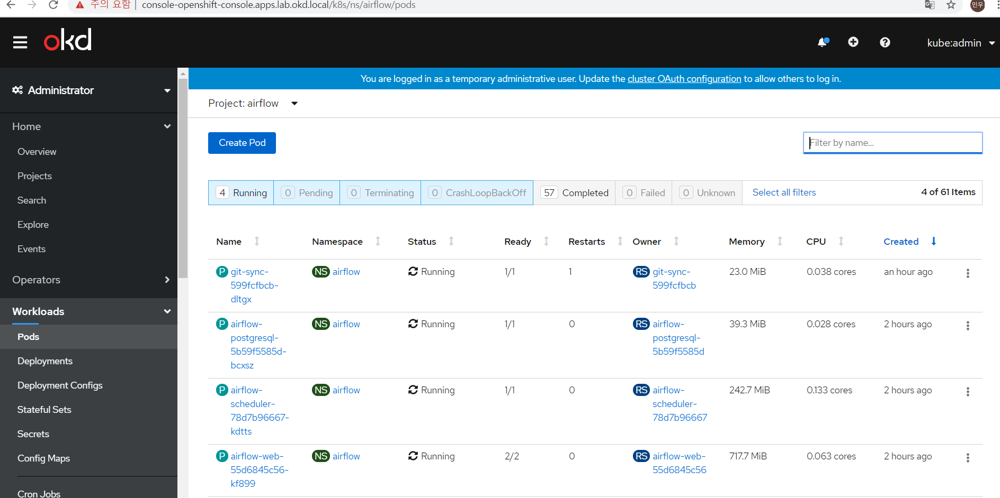
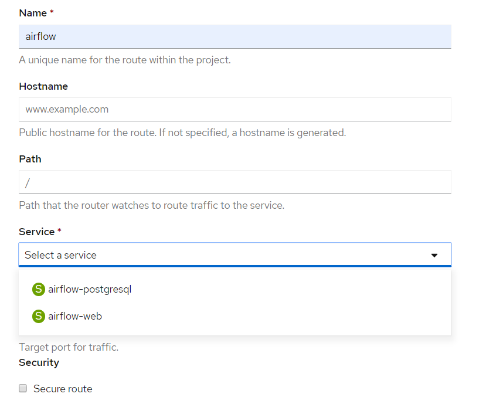
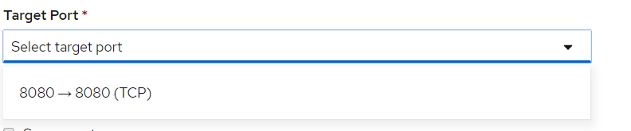
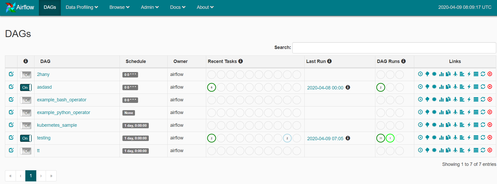
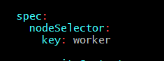

## Airflow on openshift 

---

kubernetes 환경에서 사용되던 airflow 를 openshift plattfom에 맞게 변경하는 작업

---

### 설치

*vpn 접속 및 host 파일 수정 가정*

[helm v3 설치](https://velog.io/@rudasoft/Helm-%EC%84%A4%EC%B9%98-m0k3y75ock)

*openshift cli 설치 가정*

*file download*

`git clone https://github.com/LeeMinWoo96/kubernetes.git`

*pod deploy*

```
cd airflow_on_openshift/airflow-kube-helm

# scc 권한 해제
./scc.sh

# pv 생성 (nfs) 
# 차후 경로 수정되면 안에 path 나 ip 변경 후 chcon -Rt svirt_sandbox_file_t <your host directory> 을 통해 selinux 보안 문백 변경

# kubectl 대신 oc 사용 가능 
kubectl create -f dagpv.yaml
kubectl create -f logpv.yaml
kubectl create -f pv.yaml


# helm install chart

helm upgrade --install airflow ./airflow/ --namespace airflow  --values ./airflow/values.yaml

```
---

### airflow 확인

*위 단계에서 permissin 문제가 발생한다면 scc 또는 selinux를 제대로 해제하지 않은것*

1. 설치 완료 후 웹 콘솔 접속



*pod가 running 상태이면 동작 완료 pending 상태라면 pv와 pvc가 정상적으로 Bounding 되었는지 확인 또는 pod을 누른 후 Event 확인*

2. airflow web 접속 
    
- 우측 메뉴에 Networking 의 Routes 선택
- Create Route 선택
- 이름과 서비스 (web) 선택
    


- port 설정 후 생성
    


- 생성된 Location 경로 host파일에 등록
    

    
- 접속하여 정상작동 확인
    


---

### 참고사항

**1. 현재 pv 경로는 192.168.1.10 의 nfshare/airflow**

**2. dag 파일들은 git에서 관리 위 git 주소의 test 디렉토리, git 주소 변경하려면 values.yaml 에서 수정**

**3. provisioner를 사용하려면 deployment 를 관리하는 yaml 파일에서 storageClassName="" -> storageClassName="<provisioner name>" 으로 변경 storageClassName="" 는 default storageClass를 사용한다는 뜻이 아니라 아예 storageClass를 사용하지 않는다는 뜻**
    
**4. 현재 pod들을 worker3 노드에 pending 되도록 고정해두었지만 deployment 관리하는 ymal 에서 지우면 사용량 적은 node에 할당**


    


---

### 참고자료

[add role to user](https://docs.openshift.com/container-platform/3.9/admin_guide/manage_rbac.html#admin-guide-manage-rbac)

[Volume Security](https://docs.openshift.com/container-platform/3.5/install_config/persistent_storage/pod_security_context.html)

[add scc](https://docs.openshift.com/enterprise/3.1/admin_guide/manage_scc.html)

[selinux](https://docs.openshift.com/container-platform/3.10/install_config/configuring_local.html)