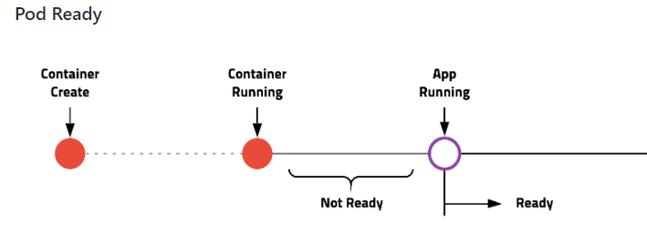

## Kubernetes 실습

[1. kubectl](#kubectl)

[2. pod](#pod)

[3. Replicaset](#Replicaset)

[4. Deployment](#Deployment)

----

pod을 지워도 pod이 다시 띄워진다면
레플리카셋이 pod을 1개로 지정했을 때 갯수가 부족해지면
deployment에 의해 새로 pod을 띄움


---

k3s -> k8s 경량 버전

단일 Master 
Multi Node

etcd 대신 Sqlite


```
curl -sfL https://get.k3s.io | sh -
sudo chown ubuntu:ubuntu /etc/rancher/k3s/k3s.yaml
```

-----
#### kubectl

*TIP alias k='kubectl' 을 입력하면 kubectl 을 k 로 대신 커맨드를 지정할 수 있습니다.*

명령과 선언의 차이
- 명령은 명령어를 통해 하는 것
- 선언은 설정파일을 통해 이루는것

**명령어**

불러오는 명령어 : get

ex)```kubctl get``` 뒤 node, pod, 등등 ...

상세내역 : describe

ex)```kubectl describe pod <podname> or kubectl describe node <nodename> ```


yaml 파일을 통해 pod 을 생성할 때 
```kubectl apply -f <filename>```

----

#### Pod



Yaml

guide-03/task-02/whoami-pod.yml
```
apiVersion: v1
kind: Pod
metadata:
  name: whoami
  labels:
    type: app
spec:
  containers:
  - name: app
    image: subicura/whoami:1
```

livenessProbe 예제 (살아 있는지 조사)

whoami-pod-lp.yml
```
##### 공통 부분 
apiVersion: v1
kind: Pod
metadata:
  name: whoami-lp
  labels:
    type: app
spec:
  containers:
  - name: app
    image: subicura/whoami:1
#####    
    livenessProbe: # 이 속성은 살아 있는지 
    # 살아있지 않으면 재요청 
      httpGet:
        path: /not/exist  # http get 을 보낼 URL 
        port: 8080
      initialDelaySeconds: 5
      timeoutSeconds: 2 # Default 1
      periodSeconds: 5 # Defaults 10
      failureThreshold: 1 # Defaults 3
```
이렇게 되면 이미지가 생성되고 실행되는데 결국 마지막에 컨테이너를 재시작하고 재요청할 것임 이유는 현재 8080 서버가 열려있지 않음


readinessProbe 예제 (컨테이너가 서비스가 가능한지 조사)

whoami-pod-rp.yml

```
apiVersion: v1
kind: Pod
metadata:
  name: whoami-rp
  labels:
    type: app
spec:
  containers:
  - name: app
    image: subicura/whoami:1
    readinessProbe:
      httpGet:
        path: /not/exist
        port: 8080
      initialDelaySeconds: 5
      timeoutSeconds: 2 # Default 1
      periodSeconds: 5 # Defaults 10
      failureThreshold: 1 # Defaults 3
```
이 경우는 아예 컨테이너가 실행되지 않음 (시작하는 명령어 자체를 통과 x)
      
health check 예제   

whoami-pod-health.yml
```
apiVersion: v1
kind: Pod
metadata:
  name: whoami-health
  labels:
    type: app
spec:
  containers:
  - name: app
    image: subicura/whoami:1
    livenessProbe:
      httpGet:
        path: /
        port: 4567
    readinessProbe:
      httpGet:
        path: /
        port: 4567
        
```
4567 은 현재 접속 가능 -> 정상 실행


pod 삭제 ```kubectl delete -f ./```

----


#### Replicaset

해당 조건에 맞는 Pod이 있는지 없다면 생성
(물론 복제 같은 경우도) 

*실제론 Deployment 를 주로 사용 (Reolicaset에서 버전을 관리한 부분만 추가된 것 *


whoami-rs.yml

```
apiVersion: apps/v1
kind: ReplicaSet
metadata:
  name: whoami-rs
spec:
  replicas: 1 # 복제 갯수 이걸 늘리면 Pod이 그만큼 생김 
  selector:
    matchLabels: # 이런 해당 라벨의 pod 있는지 체크 
      type: app  # type 은 app 이면서
      service: whoami # whoami 라는 pod 이 있니 ? 
  template: # 만약 저런 pod 이 없으면 이 아래에 처럼 생긴 pod 을 만들겠다. 
    metadata:
      labels:
        type: app
        service: whoami
    spec:
      containers:
      - name: whoami
        image: subicura/whoami:1
        livenessProbe:
          httpGet:
            path: /
            port: 4567

````
지금 만들어진 pod 이 없었으니 아래 설정한 것 처럼 Pod이 생겼을 것


----

#### Deployment

레플리카셋의 기능을 Deployment가 이용해 Pod 갯수를 조정
또한 버전관리를 지원함


whoami-deploy.yml

```
apiVersion: apps/v1beta2
kind: Deployment
metadata:
  name: whoami-deploy
spec:
  replicas: 3
  selector:
    matchLabels:
      type: app
      service: whoami
  template:
    metadata:
      labels:
        type: app
        service: whoami
    spec:
      containers:
      - name: whoami
        image: subicura/whoami:1
        livenessProbe:
          httpGet:
            path: /
            port: 4567
```


**버전관리**

전 버전 확인

```
kubectl rollout history -f whoami-deploy.yml
kubectl rollout history -f whoami-deploy.yml --revision=2
```

버전 rollback ```kubectl rollout undo deploy/whoami-deploy```

---


Evicted delete 
```kubectl get pods --all-namespaces | grep Evicted | awk '{print $2 " --namespace=" $1}' | xargs kubectl delete pod```


참고자료

[강의 github 자료(출처)](https://github.com/subicura/workshop-k8s-basic/blob/master/guide/guide-03/task-02.md)