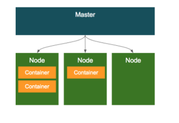
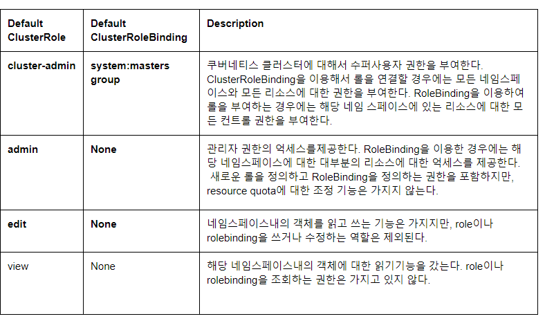

## kubernetes 이론

우선 클러스터 구조 

### Pod
Pod 는 쿠버네티스에서 가장 기본적인 배포 단위로, 컨테이너를 포함하는 단위이다.

쿠버네티스의 특징중의 하나는 컨테이너를 개별적으로 하나씩 배포하는 것이 아니라 Pod 라는 단위로 배포하는데, Pod는 하나 이상의 컨테이너를 포함한다.

**특징**

    Pod 내의 컨테이너는 IP와 Port를 공유한다. 
    두 개의 컨테이너가 하나의 Pod를 통해서 배포되었을때, localhost를 통해서 통신이 가능하다.
    예를 들어 컨테이너 A가 8080, 컨테이너 B가 7001로 배포가 되었을 때, B에서 A를 호출할때는 localhost:8080 으로 호출하면 되고, 반대로 A에서 B를 호출할때에넌 localhost:7001로 호출하면 된다. 

    Pod 내에 배포된 컨테이너간에는 디스크 볼륨을 공유할 수 있다. 
    근래 애플리케이션들은 실행할때 애플리케이션만 올라가는것이 아니라 Reverse proxy, 로그 수집기등 다양한 주변 솔루션이 같이 배포 되는 경우가 많고, 특히 로그 수집기의 경우에는 애플리케이션 로그 파일을 읽어서 수집한다. 애플리케이션 (Tomcat, node.js)와 로그 수집기를 다른 컨테이너로 배포할 경우, 일반적인 경우에는 컨테이너에 의해서 파일 시스템이 분리되기 때문에, 로그 수집기가 애플리케이션이 배포된 컨테이너의 로그파일을 읽는 것이 불가능 하지만, 쿠버네티스의 경우 하나의 Pod 내에서는 컨테이너들끼리 볼륨을 공유할 수 있기 때문에 다른 컨테이너의 파일을 읽어올 수 있다.

### Configmap

설정 정보를 저장해놓는 일종의 저장소 역할을 한다.
key/value 형식으로 저장이 된다.

컨테이너에서 필요한 환경설정 내용을 컨테이너와 분리해서 제공해 주기 위한 기능 
예를 들어 지금 경우에는 configmap에 airflow.cfg 내용을 정의해두면 airflow 생성할때 해당 내용을 참조해서 airflow.cfg 파일이 생성됨 

### Role

권한은 Role이라는 개념으로 정의가 되는데, 이 Role에는 각각의 리소스에 대한 권한이 정의된다.
예를 들어 pod에 정보에 대한 create/list 등을 정의 할 수 있다.
생성된 Role을 계정과 **RoleBinding** 이라는 정의를 통해서 계정과 연결이 된다. 

Role 과 clusterRole

Role의 적용 범위에 따라 ClusterRole과 일반 Role로 분리 된다.
Role의 경우 특정 네임스페이스 리소스에 대한 권한을 정의할 수 있다 
반면 clusterRole의 경우 Cluster 전체에 걸쳐서 권한을 정의할 수 있다는 차이가 있다.

Role일땐 RoleBinding cluster일딴 ClusterRoleBinding을 통해서 적용된다. 

쿠버네티스에는 편의를 위해서 미리 정해진 룰이 있다 .

### PV, PVC

PV 는 볼륨 그 자체를 의미하고 PVC 는 PV 에게 적용하는 요청
마운트는 이름기반임 예를들어 git 컨테이너에 airflow-dag의 이름으로 어떤 경로를 지정해둠
다른 에어플로우 컨테이너에서 같은 airflow-dage 이름으로 경로를 지정해주면 서로 연결되는 것 

PVC ymal 파일에서 지정해주면 따로 pod에서 지정하지 않아도 되지만 아닐경우 volume type 같은걸 명시해줘야함 

## 조대협님 블로그가 잘 정리되어 있습니다. 

출처

[조대협의 블로그](https://bcho.tistory.com/1256?category=731548 )